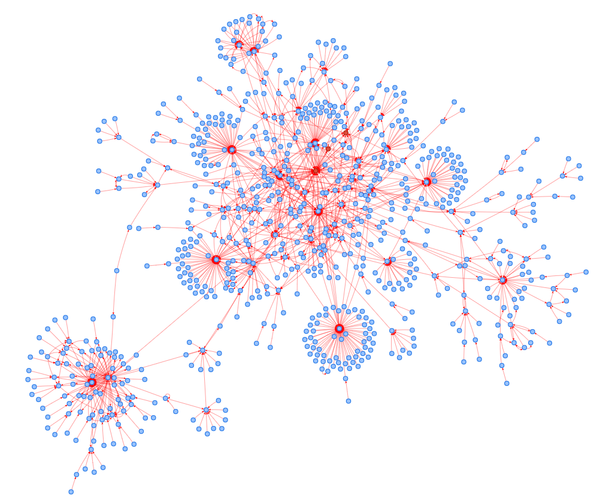

# Wikipedia-COVID-structure

### Extract Templates (links) Information from the article.
#### graph_main_from_dump_read-all.ipynb
Reads all the articles from each languages and make adjacency lists.
#### graph_main_from_dump.ipynb
Build adjacency lists using Breadth First Search, starting from the three seed items

### Convert article names to the QIDs to handle all the redirect names
#### title2qid.py
Collect Title-QID map for all the articles in adjacency list using wikipedia API. 

ex) <https://en.wikipedia.org/w/api.php?action=query&prop=pageprops&ppprop=wikibase_item&redirects=1&format=json&titles=COVID-19>

To make the process faster, we applied multiprocessing.
#### name2qid.ipynb
Convert all the article titles in adjacency list to QIDs using title-qid map.

If the article does not have QID, keep the original title.

Title-QID map was collected using wikipedia API.

### Visualize Network Graph
#### Json2graph.ipynb
Read adjacency list in Json file format and visualize network graph using networkx library.

Example) English Wikipedia COVID-structure

#### Interactive Visualizations
[English](https://danu0227.github.io/Wikipedia-COVID-structure/Results/Networks/qid_en_5.html)
[Spanish](https://danu0227.github.io/Wikipedia-COVID-structure/Results/Networks/qid_es_5.html)
[French](https://danu0227.github.io/Wikipedia-COVID-structure/Results/Networks/qid_fr_5.html)
[German](https://danu0227.github.io/Wikipedia-COVID-structure/Results/Networks/qid_de_5.html)
[Arabic](https://danu0227.github.io/Wikipedia-COVID-structure/Results/Networks/qid_ar_5.html)
[Portuguese](https://danu0227.github.io/Wikipedia-COVID-structure/Results/Networks/qid_pt_5.html)
[Chinese](https://danu0227.github.io/Wikipedia-COVID-structure/Results/Networks/qid_zh_5.html)
[Russian](https://danu0227.github.io/Wikipedia-COVID-structure/Results/Networks/qid_ru_5.html)
[Korean](https://danu0227.github.io/Wikipedia-COVID-structure/Results/Networks/qid_ko_5.html)
[Japanese](https://danu0227.github.io/Wikipedia-COVID-structure/Results/Networks/qid_ja_5.html)

### Count the articles containing keyword
#### Count_keyword.ipynb
Count the keywords contained in all the articles in wikipedia.

Calculate the ratio of keyword-containing articles in the network.
